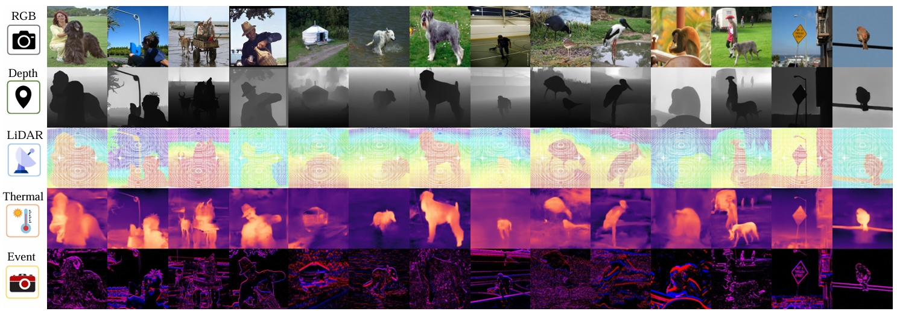
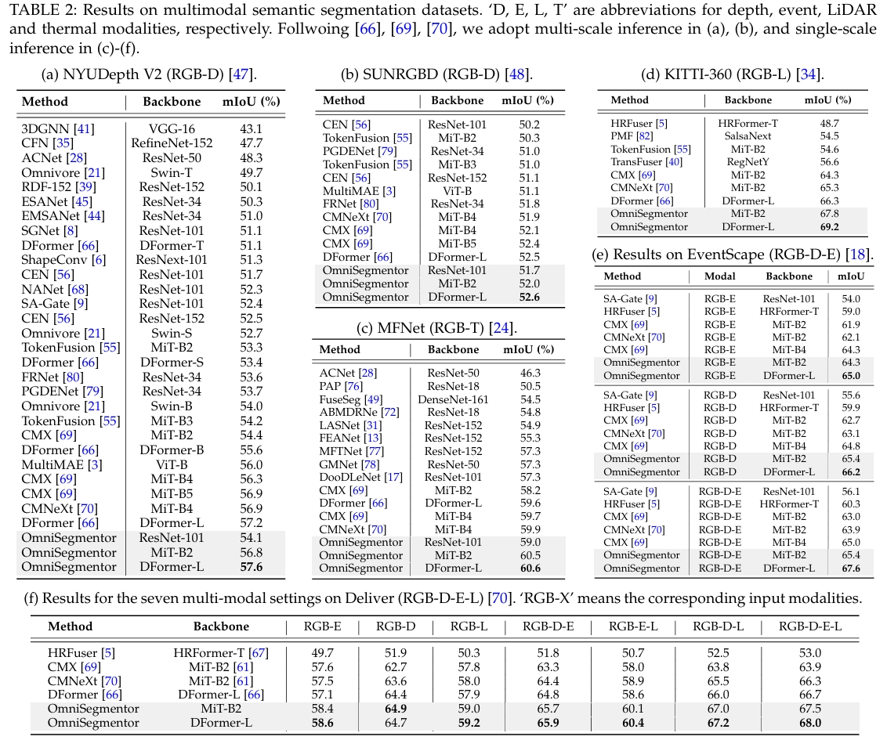

# <p align=center>`OmniSegmentor: A Flexible Multi-Modal Learning Framework for Semantic Segmentation`</p>

> **Authors:**
> [Bowen Yin](https://scholar.google.com/citations?user=xr_FRrEAAAAJ&hl=zh-CN&oi=sra),
> [Jiaolong Cao](),
> [Xuying Zhang](https://scholar.google.com/citations?hl=zh-CN&user=huWpVyEAAAAJ),
> [Yuming Chen](https://scholar.google.com/citations?user=EweNbRAAAAAJ&hl=zh-CN),
> [Ming-Ming Cheng](https://scholar.google.com/citations?hl=zh-CN&user=huWpVyEAAAAJ),
> [Qibin Hou*](https://scholar.google.com/citations?user=fF8OFV8AAAAJ&hl=zh-CN)


This paper is still under review. Full code, complete ImageNeXt dataset, and model checkpoints will be publicly released upon acceptance. 

This official repository of ' OmniSegmentor: A Flexible Multi-Modal
 Learning Framework for Semantic Segmentation'.
This paper provides a large-scale multi-modal dataset (ImageNeXt) and a general multi-modal pretraining and finetuning framework.
You can pretrain more powerful multi-modal encoders and contribute to the RGBX research.


<!-- We invite all to contribute in making it more acessible and useful. If you have any questions about our work, feel free to contact me via e-mail (bowenyin@mail.nankai.edu.cn).  -->


<p align="center">
     <br />
    <em> 
    Figure 1: Visualizations of our assembled ImageNeXt dataset. Built upon ImageNet [43], a widely used large-scale RGB classification dataset, ImageNeXt is composed of five popular visual modalities for each sample, including RGB, Depth, LiDAR, Thermal, and Event.
    </em>
</p>

<!-- <p align="center">
     <br />
    <em> 
    Figure 2: Overview of the DFormer.
    </em>
</p> -->


<!-- 
## 1. 🌟  NEWS 

- [2025/02/27] This paper is released at [Arxiv](). -->


<!-- ## 2. 🚀 Preparing the ImageNeXt (to do)

We will directly provide the generated supplementary modalities in the following.

| Modality | Download Link | 
|:---: |:---:|
|RGB|Comming soon|
|Depth|Comming soon|
|LiDAR|Comming soon|
|Event|Comming soon|
|Thermal|Comming soon|

If you want to generate these modalities by youself or generate on your own dataset, you can follow the below tutorials.

Depth:

LiDAR:

Event:

Thermal：

<summary>Orgnize the ImageNeXt folder in the following structure:</summary>
<pre><code>

```shell
<ImageNeXt>
|-- <train>
    |-- <RGB>
        |-- <>
    |-- <Depth>
    |-- <LiDAR>
    |-- <Event>
    |-- <Thermal>
|-- <val>
    |-- <NYUDepthv2>
        |-- ...
    |-- <SUNRGBD>
        |-- ...
```
</code></pre> -->


## 🚀 Performance Comparison

<p align="center">
     <br />
    <em> 
    </em>
</p>

<!-- ## 4. 🚀 Pretraining && Finetuning -->


<!-- <p align="center">
     <br />
    <em> 
    </em>
</p> -->


<!-- ## Reference
You may want to cite:
```
@article{yin2023dformer,
  title={DFormer: Rethinking RGBD Representation Learning for Semantic Segmentation},
  author={Yin, Bowen and Zhang, Xuying and Li, Zhongyu and Liu, Li and Cheng, Ming-Ming and Hou, Qibin},
  journal={arXiv preprint arXiv:2309.09668},
  year={2023}
}
``` -->

<!-- 
### Acknowledgment

Our implementation is mainly based on [mmsegmentaion](https://github.com/open-mmlab/mmsegmentation/tree/v0.24.1), [timm](https://github.com/huggingface/pytorch-image-models), [DFormer](https://github.com/VCIP-RGBD/DFormer) and [CMNext](https://github.com/jamycheung/DELIVER). Thanks for their authors.


### License

Code in this repo is for non-commercial use only. -->


